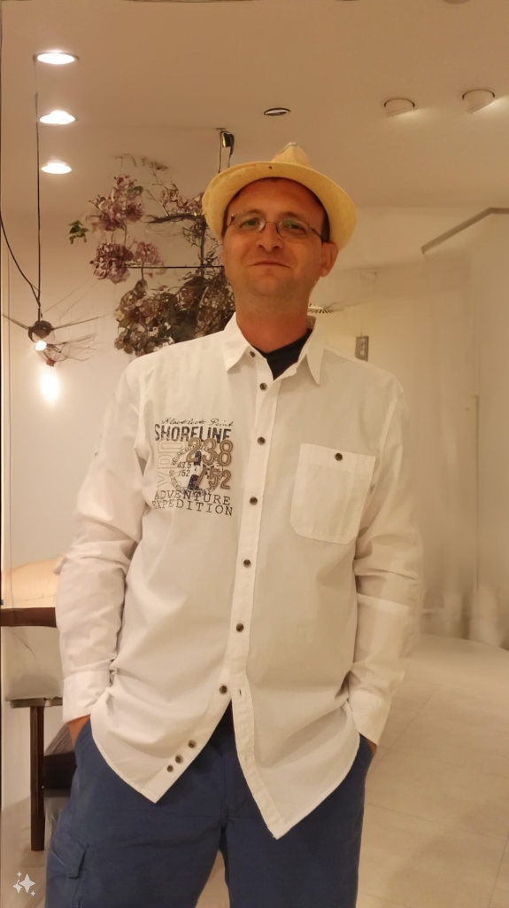

 ## Hi there! I'm Pavel Lakov

I'm Pavel from Germany, a dedicated developer with a deep passion for both frontend and backend development. My journey through code and design has led me to explore a variety of languages and frameworks, each adding a new layer of expertise to my skill set.

I build end‑to‑end web products—fast UIs, reliable APIs, and practical AI features—shipped with automation and observability.

### What I do
- **Frontend:** React / Next.js, TypeScript, Tailwind, responsive UI/UX systems, design handoff.
- **Backend:** Python (FastAPI, Django, Flask), REST/GraphQL, auth, background jobs, caching, testing.
- **AI/ML:** OpenAI API, embeddings/RAG, lightweight model serving, prompt tooling, data pipelines.
- **DevOps:** Docker, GitHub Actions, CI/CD, monitoring/logging, deploys to AWS/Spaces/Render.

### Recent work
- **Image Downloader Web** — mage Downloader Web** — Streamlit app resolving photo pages to direct images via oEmbed + heuristics. [Live](https://huggingface.co/spaces/pavellakov/image-downloader-web) · [Code](https://github.com/pavellakov/image-downloader-web)               . [Live](https://huggingface.co/spaces/pavellakov/image-downloader-web) · [Code](https://github.com/pavellakov/image-downloader-web)
- **Video Converter** — Flask + JS app for browser-based video compression. [Repo](<[link](https://github.com/PavelLakov/-Video-Converter)>)
- **Cipher Decoder/Encoder** — Python utility for quick text ciphers. [Repo](<https://github.com/PavelLakov/Caesar-Cipher-Decoder-and-Encoder>)
- **Video Compressor**- video compression tool built with Gradio for the user interface and FFmpeg for the actual compression.[Repo](<https://github.com/PavelLakov/Video-Compressor>)

### Tech I rely on
`Python` · `FastAPI` · `Django` · `Flask` · `JavaScript` · `TypeScript` · `React` · `Node.js` · `HTML/CSS/Tailwind` · `PostgreSQL` · `MongoDB` · `Vector DBs (Pinecone/Chroma)` · `Docker` · `Hugging Face` · `OpenAI API` · `LangChain`

### How I work
- Pragmatic, test‑first APIs with clear contracts.
- Componentized frontends with sensible design tokens.
- CI/CD by default; small, reviewable PRs.
- Observability: metrics/logs early to de‑risk launches.

### Currently learning
- Smaller, efficient LLM serving + prompt guards.
- Better DX with Turbo/PNPM monorepos for full‑stack apps.

### Outside of code
Trail runs, cycling, football; travel for fresh ideas and perspective.

### Contact
- Email: <pavel.lakov@gmail.com>
- LinkedIn: <https://www.linkedin.com/in/pavellakov/>
